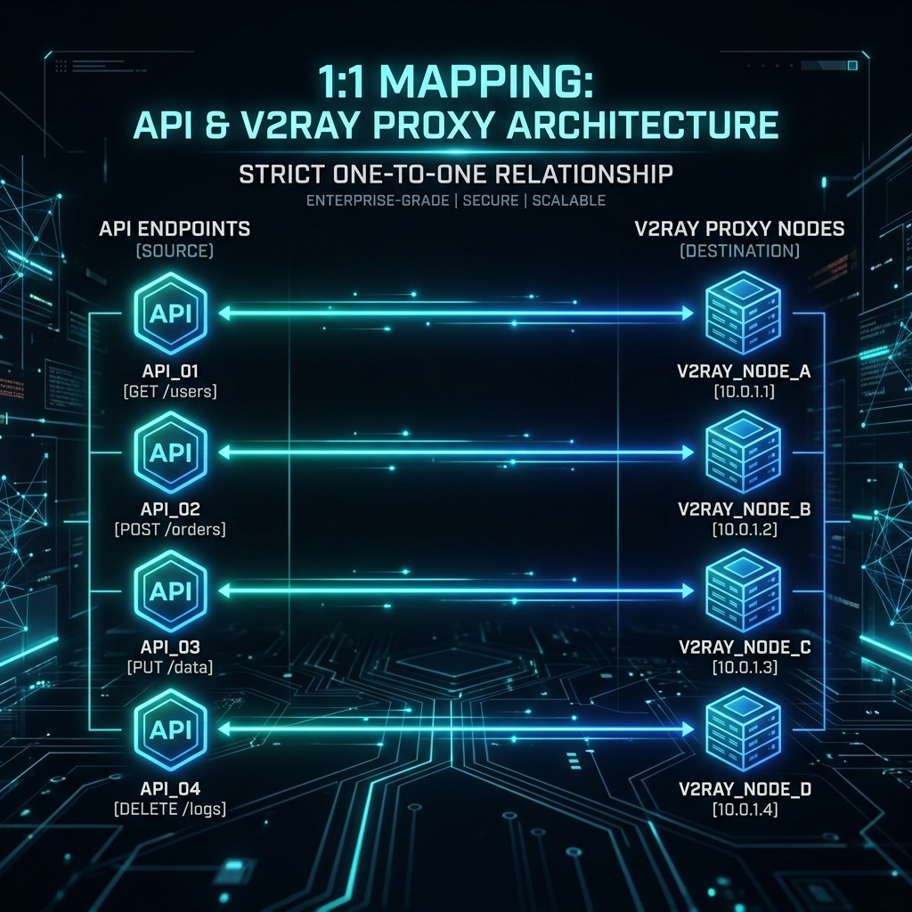

# GoAI Relay：基于 Go 的 OpenAI 兼容智能中转网关

[English](README.md) | [中文](README_zh.md)

<p align="center">
  
</p>


> **基于 Go 构建的高性能 OpenAI 兼容 API 中转平台，支持多种 V2Ray 内核订阅格式，提供统一接入、订阅解析、节点管理与稳定转发能力。**

**本项目是一个使用 Go 语言构建的 OpenAI 兼容 API 中转平台，面向高并发、可扩展和多节点接入场景设计。平台兼容多种 V2Ray 内核订阅格式，能够对订阅内容进行统一解析、管理与转发。**

**💡 核心独创特性：一节点一接口 (1:1 Proxy-to-API Binding)**
平台具备极其灵活的出口控制能力，支持**“一个代理节点严格适配一个 API 链接”**。通过底层的精准路由绑定，确保不同的 API 请求能够通过指定的 V2Ray 节点（如 VLESS, Hysteria2 等）稳定、安全地直达上游，为开发者和服务提供者提供稳定、高效、灵活的 AI API 接入层解决方案。

## 🚀 核心特性

*   **智能路由与熔断机制 (Intelligent Routing & Failover)**
    支持动态节点评估与自动熔断，内置多级故障转移策略（自定义冷却机制、上游备用回退）。
*   **去中心化节点管理 (Decentralized Node Management)**
    原生集成 Xray-core 底层，透明管理复杂的代理拓扑。支持零宕机配置热重载以及实时订阅解析。
*   **全协议支持 (Omni-Protocol Support)**
    无缝接管多种传输层协议，涵盖：VLESS (xtls-rprx-vision/reality), Hysteria2, VMess, Trojan，以及标准的 Shadowsocks/SOCKS5。
*   **LLM API 专项优化 (LLM API Optimization)**
    专为 OpenAI 及兼容格式的 API schema 打造。内置请求多路复用（Multiplexing）、智能节点绑定（Endpoint Binding）以及无缝的数据流传输（Payload Streaming）。
*   **零开销启动 (Zero-Overhead Bootstrap)**
    扁平化的运行时生成逻辑，保证极低的 GC 停顿与内存占用，最大化并发吞吐量。

## 🏗️ 架构设计

在核心实现上，`API-V2Ray` 采用了确定性的多阶段处理流水线：
1.  **Ingress (入口网络):** 轻量级、高并发的 HTTP 层，负责承接客户端的 RESTful 呼叫。
2.  **Router/Binder (路由与绑定器):** 基于上游映射、熔断状态机和优先级队列执行动态流量调度。
3.  **Proxy Runtime (代理运行时):** 动态生成与特定节点配置严格绑定的 Xray Outbounds（出站协议）。
4.  **Egress (出口网络):** 借助底层的 Xray 进程建立多路复用的加密安全隧道，完成到达上游 AI 端点的“最后一公里”。

## 🛠️ 快速开始

### 环境依赖
- Go 1.22+
- 预编译的 Xray-core 二进制文件（默认放置于 `./.bin/xray`）

### 构建与运行
```bash
# 克隆仓库
git clone https://github.com/your-org/api-v2ray.git
cd api-v2ray

# 构建二进制文件
go build -o bin/api-v2ray ./cmd/api-v2ray

# 使用本地配置运行
./bin/api-v2ray -config ./configs/config.local.json
```

## 📜 配置映射

`API-V2Ray` 采用高度健壮的 JSON/YAML schema 来映射上游（upstreams）、代理节点（proxy nodes）以及绑定关系（bindings）。核心组件包括：
- `upstreams`: 定义目标 AI 端点（例如 GPT-4 接口）以及鉴权密钥。
- `proxy_nodes`: 定义原始的代理链接（VLESS, Hysteria2 等）。
- `bindings`: 将特定上游与代理节点硬性绑定，以实现确定性的出口路由。

详尽的架构参考请查阅 `configs/config.example.json`。

---
*为构建坚不可摧的分布式网络而生。*
